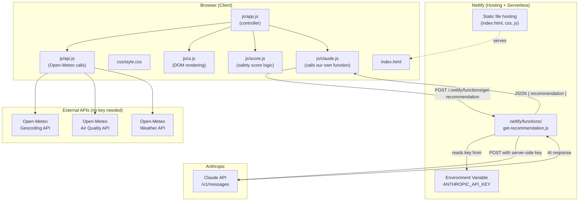
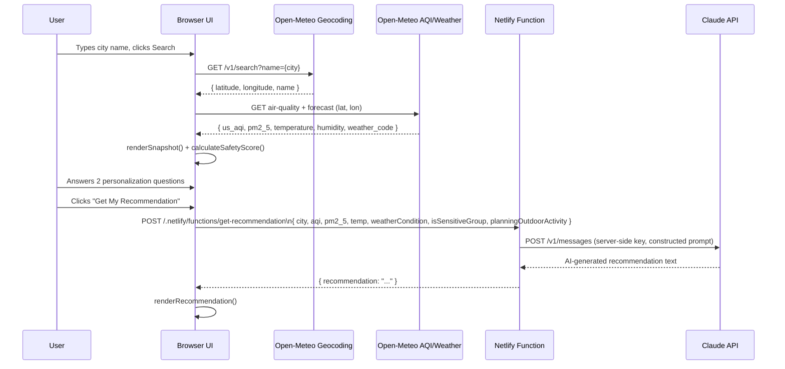
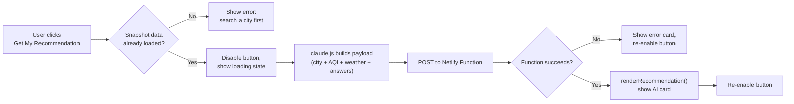

# AirSense — System Architecture

**Status:** Locked for implementation (Days 3–9)
**Source of truth:** PRD v1.0, Implementation Blueprint (Day 1)
**No database, no authentication** — this app is fully stateless. All "state" lives in the browser tab for the duration of a session.

---

## 1. Component Diagram



**Why this shape:** the browser never talks to Claude directly. Every AI call is proxied through a Netlify Function so the API key stays server-side. This is the one non-negotiable security boundary in the whole system (PRD §8, Non-Functional Requirements — Security).

---

## 2. Data Flow (End-to-End)



---

## 3. Request Lifecycle — "Get My Recommendation" Click



This lifecycle directly drives the error-handling and button-disable logic specified for Day 5 and tested on Day 8.

---

## 4. AI Interaction Detail

**Where it happens:** exclusively inside `netlify/functions/get-recommendation.js` — never in browser JS.

**Trigger:** POST request from `js/claude.js` after the user has (a) successfully loaded a city snapshot and (b) answered both personalization questions.

**Request body sent to the Netlify Function:**
```json
{
  "city": "Ghaziabad",
  "aqi": 187,
  "pm2_5": 92.3,
  "temperature": 31,
  "weatherCondition": "Haze",
  "isSensitiveGroup": true,
  "planningOutdoorActivity": true
}
```

**What the Function does:**
1. Validates the incoming body (see API.md for validation rules).
2. Constructs a bounded prompt (explicit instruction: 3–4 sentences, plain English, no disclaimers, no markdown).
3. Calls Claude's `/v1/messages` endpoint using `ANTHROPIC_API_KEY` from the Netlify environment variable.
4. Returns `{ recommendation: "<text>" }` to the browser, or a clear error object on failure.

**Why server-side only:** this is the single most important architectural decision in the project — it satisfies PRD §8 (Security) and is the reason a "backend" exists at all in an otherwise frontend-only app.

---

## 5. External Services Summary

| Service | Purpose | Auth | Notes |
|---|---|---|---|
| Open-Meteo Geocoding API | City name → lat/lon | None (keyless) | `https://geocoding-api.open-meteo.com/v1/search` |
| Open-Meteo Air Quality API | Live AQI, PM2.5, PM10 | None (keyless) | `https://air-quality-api.open-meteo.com/v1/air-quality` |
| Open-Meteo Weather API | Temp, humidity, weather code | None (keyless) | `https://api.open-meteo.com/v1/forecast` |
| Anthropic Claude API | Health recommendation generation | API key (server-side only) | Called only from the Netlify Function |
| Netlify | Hosting + serverless functions + env vars | Netlify account | Same platform used for both static hosting and the function |

---

## 6. Why No Database / No Auth (Confirming PRD Alignment)

The PRD explicitly excludes user accounts, saved cities, and history from v1.0 (§5.2). Every screen's data is derived fresh from a live API call and held only in JS variables/DOM state for that session. Closing the tab clears everything — this is intentional, not a limitation we're working around. If v1.1 ever adds "saved cities" (mentioned as future scope in the Pitch Deck), that would be the first point a database (or simply `localStorage`) enters the picture — not before.
