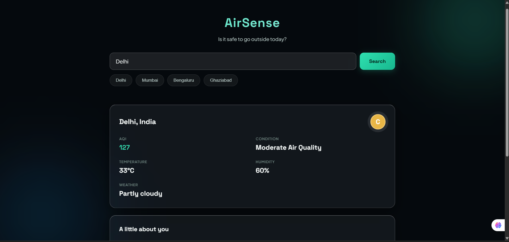
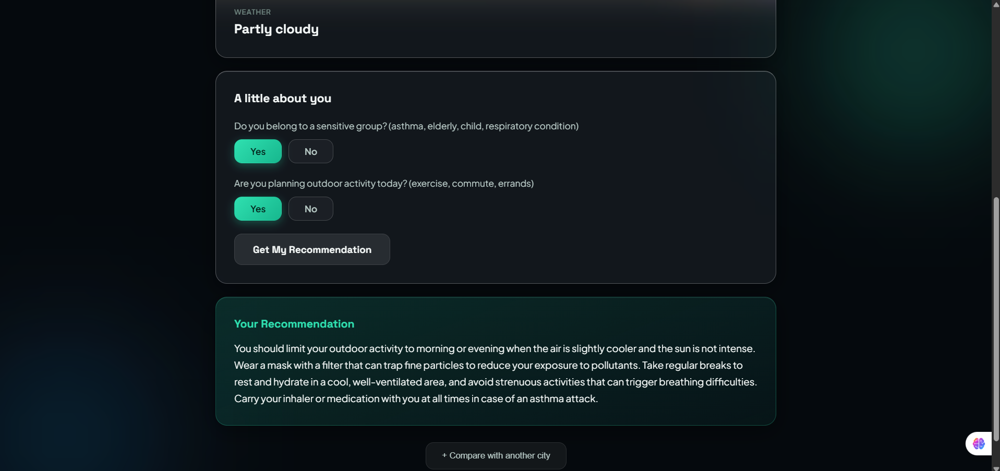
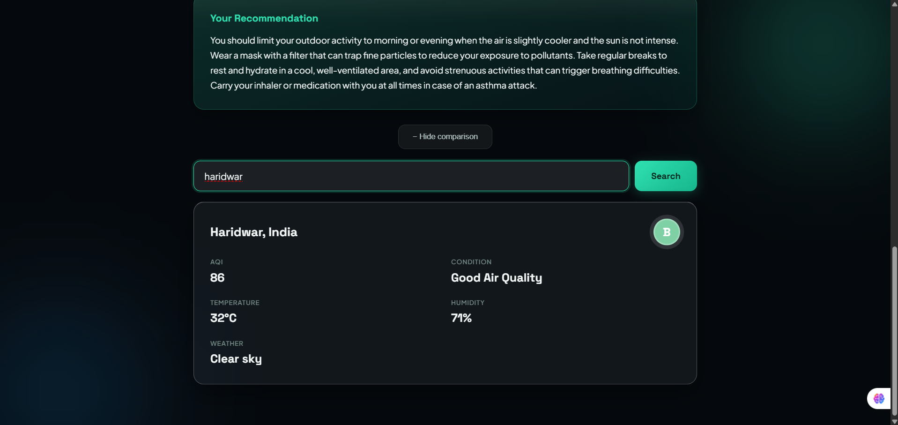

# AirSense — Day 60 Capstone Submission

**Challenge:** AB Talks 60-Day Claude AI Challenge — 10-Day Capstone
**Builder:** Rahul Singh ([@RahulSingh873](https://github.com/RahulSingh873) · [LinkedIn](https://linkedin.com/in/rahul-singh-754714332))
**Status:** ✅ v1.0 shipped, live, tested, documented
**Timeline:** 10 days, ~2 hours/day (~18 hours total build time)

---

## 🔗 Links

| | |
|---|---|
| **Live product** | [airsenseanalysis.netlify.app](https://airsenseanalysis.netlify.app) |
| **Source code** | [github.com/RahulSingh873/airsense](https://github.com/RahulSingh873/airsense) |
| **Release tag** | [`v1.0`](https://github.com/RahulSingh873/airsense/releases/tag/v1.0) |

---

## What AirSense Does

AirSense turns raw air quality data into a personal answer to the question everyone actually has: **"Is it safe for me to go outside today?"**

Instead of showing a bare AQI number, AirSense asks two quick questions about the person searching — do they belong to a sensitive group (asthma, elderly, child, respiratory condition), and are they planning outdoor activity — and uses that context plus live air quality and weather data to generate a genuinely personalized, plain-English health recommendation.

### Core Features (v1.0)

1. **City search** — any city worldwide, plus one-tap quick-select for Delhi, Mumbai, Bengaluru, and Ghaziabad
2. **Live snapshot** — real-time AQI, temperature, humidity, and weather condition
3. **Personalized AI recommendation** — a short, specific, non-generic health recommendation generated from live data + personal context
4. **Gamified Safety Score** — an instant A–F grade so the situation is legible before reading a word
5. **Compare 2 Cities** — side-by-side AQI, weather, and safety score for two locations at once
6. **Secure architecture** — the AI API key never touches the browser; every AI call is routed through a serverless proxy

---

## Product Walkthrough

### 1. Search & Live Snapshot

A city search returns live AQI, temperature, humidity, and weather condition, with the Safety Score badge (color- and letter-graded) visible at a glance.

### 2. Personalization & AI Recommendation

Two quick yes/no questions personalize the advice — the AI recommendation below responds specifically to a "sensitive group: yes" + "outdoor activity: yes" combination, naming a filtered mask, hydration breaks, and carrying an inhaler, rather than generic filler text.

### 3. Compare 2 Cities

Toggling Compare Mode reveals a second search, rendering both cities independently using the same snapshot logic — here comparing Delhi's moderate air quality against Haridwar's clear, good-air-quality reading.

---

## How It Was Built

Followed a real software development lifecycle across 10 days — Requirements → Design → Setup → Implementation → Testing → Deployment → Maintenance — with a fresh, self-contained daily plan so the project never required re-deciding architecture mid-build.

| Day | Focus | Outcome |
|---|---|---|
| 1 | Product Discovery & Sprint Planning | Interviewed idea from scratch, scoped v1.0, generated PRD, blueprint, pitch deck |
| 2 | System Design | Architecture, schema, API contracts, wireframes, project structure — all before writing code |
| 3 | Project Setup & Foundation | Repo, folder scaffolding, live-tested Open-Meteo APIs, working "hello world" serverless function |
| 4 | Core Feature Implementation | City search + live AQI/weather snapshot rendering |
| 5 | Core Feature Development | Personalization questions + real AI recommendation pipeline |
| 6 | MVP Complete | Safety Score + Compare 2 Cities — all 8 v1.0 features functional |
| 7 | Product Refinement | Full CSS design system pass, loading states, animations — caught and fixed a truncated-file bug |
| 8 | Testing & Debugging | Deliberately tried to break the app — input edge cases, rapid interactions, offline mode |
| 9 | Launch & Production Readiness | Premium glassmorphism redesign, deployed to Netlify, verified live on desktop and real mobile device |
| 10 | Final Review & Graduation | Final QA pass, documentation, v1.0 tagged and shipped |

### Tech Stack

- **Frontend:** Vanilla HTML, CSS, JavaScript — no framework
- **Backend:** Netlify Functions (serverless, Node.js) — the only backend surface in the project, used exclusively to keep the AI API key server-side
- **Data:** Open-Meteo Geocoding, Air Quality, and Weather APIs — free, keyless, global coverage
- **AI:** Currently running on Groq (`llama-3.3-70b-versatile`) as a temporary substitute during development, adopted after hitting an Anthropic API billing step mid-build. The architecture is fully Claude-ready — swapping providers back requires changing only the `fetch()` call and headers inside the single serverless function, with zero changes to the frontend, data flow, or security model.
- **Hosting:** Netlify (static hosting + serverless functions + environment variables)
- **No database, no authentication** — deliberately excluded from v1.0 since no user story required persistence; documented explicitly in `SCHEMA.md` rather than silently omitted

---

## Real Engineering Moments (Not Just a Prompt-and-Done Build)

A few genuine problems surfaced and were debugged during the build, worth noting because they're the actual evidence of hands-on work:

- **Day 5:** Two rendering functions were accidentally pasted inside another function's closing braces, silently breaking the AI recommendation button with no visible error until the browser console was inspected.
- **Day 7:** A large CSS paste got truncated mid-file, causing the empty state and personalization section to render incorrectly on first load — diagnosed by directly inspecting the raw CSS served by the local dev server, not by guessing.
- **Day 8:** Full adversarial testing — offline network simulation, rapid double-clicks, malformed and ambiguous city input — all handled gracefully with zero crashes.
- **Deployment:** API keys were briefly exposed in an unredacted screenshot during Netlify environment variable setup; both keys were immediately rotated before deployment proceeded, treating it as a real security event rather than a minor slip.

---

## What's Explicitly Out of v1.0 (Future Scope)

Deliberate scope decisions, not oversights — each below was left out to protect a focused, polished v1.0 within a ~18-hour build budget:

- React migration (vanilla JS was chosen specifically because this was a first React attempt — a deliberate, honest scoping call from Day 1)
- Full Claude API integration (architecture-ready; blocked only by an Anthropic billing step, currently substituted with Groq)
- Historical AQI trend charts
- Saved/bookmarked cities or user accounts
- More than 2-city comparison
- Map view or location autocomplete

---

## Closing Note

The goal from Day 1 wasn't the most ambitious project possible — it was the most complete one achievable in the real time available, built by hand and understood end to end rather than generated and accepted. Ten days of disciplined, ~2-hour sessions, a documented paper trail from idea to deployed product, and a handful of real bugs found and fixed along the way are the actual proof of that.
