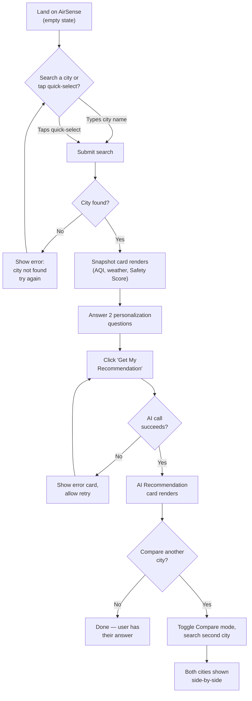
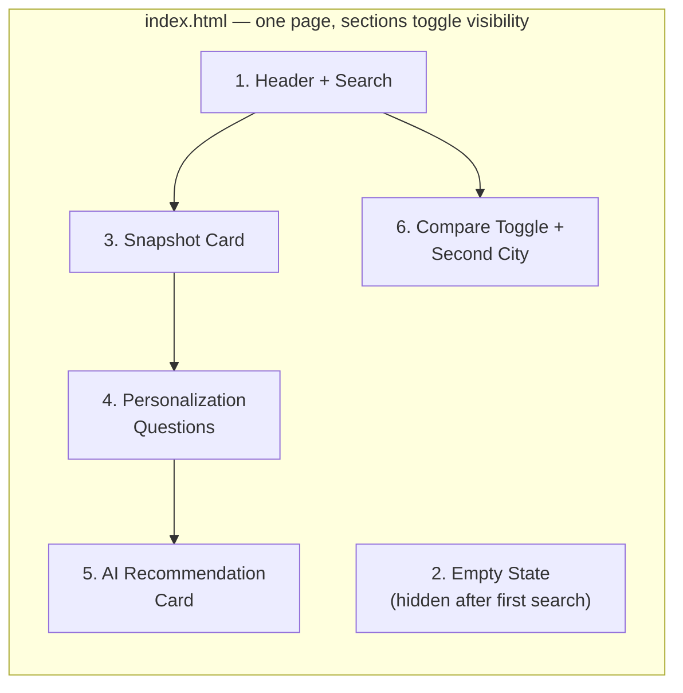

# AirSense — UI & User Flow

## 1. User Flow Diagram



This single flow satisfies all 5 user stories from the PRD (§6) — there is no dead-end screen and no screen that exists without a job to do, per today's "every screen should exist for a reason" requirement.

---

## 2. Screen Flow (Single-Page App — no routing needed)

AirSense is a **single HTML page** with dynamically shown/hidden sections — not a multi-page app. There's no router, no page reloads. This matches the "vanilla JS, no framework" decision and keeps Day 4-7 implementation simple.



- **Section 2 (Empty State)** is visible only before the first search — this exists so the app never looks broken on first load (per Day 7's polish plan).
- **Sections 3–5** appear once real data exists.
- **Section 6** is optional and user-triggered — it doesn't clutter the default single-city experience.

---

## 3. Low-Fidelity Wireframes

### 3.1 Initial / Empty State (first load, before any search)

```
┌──────────────────────────────────────────────────┐
│  AIRSENSE                                          │
│  Is it safe to go outside today?                  │
│                                                     │
│  ┌───────────────────────────┐  ┌───────────┐    │
│  │ Search any city...         │  │  Search   │    │
│  └───────────────────────────┘  └───────────┘    │
│                                                     │
│  Quick select:                                     │
│  [ Delhi ] [ Mumbai ] [ Bengaluru ] [ Ghaziabad ]  │
│                                                     │
│                                                     │
│              (empty state illustration)            │
│         "Search a city to get started"             │
│                                                     │
└──────────────────────────────────────────────────┘
```

### 3.2 Single City — Snapshot Loaded

```
┌──────────────────────────────────────────────────┐
│  AIRSENSE                                          │
│  [ Search bar ]  [ Search ]                        │
│  [ Delhi ][ Mumbai ][ Bengaluru ][ Ghaziabad ]     │
│  ┌────────────────────────────────────────────┐   │
│  │ GHAZIABAD, INDIA                             │   │
│  │                                               │   │
│  │   AQI: 187 (Poor)         Safety Score: D    │   │
│  │   31°C · 58% Humidity · Haze                 │   │
│  └────────────────────────────────────────────┘   │
│                                                     │
│  A little about you:                               │
│  Sensitive group (asthma, elderly, child)?         │
│    ( ) Yes   ( ) No                                │
│  Planning outdoor activity today?                  │
│    ( ) Yes   ( ) No                                │
│                                                     │
│         [ Get My Recommendation ]                  │
│                                                     │
│  [ + Compare with another city ]                   │
└──────────────────────────────────────────────────┘
```

### 3.3 AI Recommendation Rendered

```
┌──────────────────────────────────────────────────┐
│  ... (snapshot card + questions, as above) ...     │
│                                                     │
│  ┌────────────────────────────────────────────┐   │
│  │  YOUR RECOMMENDATION                          │   │
│  │  "Air quality is currently poor. Since        │   │
│  │  you're in a sensitive group, avoid           │   │
│  │  strenuous outdoor activity today and         │   │
│  │  wear a mask if you must go out."             │   │
│  └────────────────────────────────────────────┘   │
│                                                     │
│  [ + Compare with another city ]                   │
└──────────────────────────────────────────────────┘
```

### 3.4 Compare Mode (2 cities side-by-side)

```
┌──────────────────────────────────────────────────┐
│  AIRSENSE — Compare Cities                         │
│                                                     │
│  ┌─────────────────────┐  ┌─────────────────────┐│
│  │ GHAZIABAD             │  │ [Search 2nd city] │[Go]││
│  │ AQI 187 · Grade D      │  │                   ││
│  │ 31°C · Haze            │  │                   ││
│  └─────────────────────┘  └─────────────────────┘│
│                                                     │
│  (After 2nd city searched:)                        │
│  ┌─────────────────────┐  ┌─────────────────────┐│
│  │ GHAZIABAD              │  │ MUMBAI              ││
│  │ AQI 187 · Grade D       │  │ AQI 62 · Grade B    ││
│  │ 31°C · Haze             │  │ 29°C · Partly Cloudy││
│  └─────────────────────┘  └─────────────────────┘│
│                                                     │
│  [ Exit Compare Mode ]                              │
└──────────────────────────────────────────────────┘
```

### 3.5 Error State (city not found)

```
┌──────────────────────────────────────────────────┐
│  AIRSENSE                                          │
│  [ Search bar: "asdkjasd" ]  [ Search ]            │
│                                                     │
│  ⚠ City not found — check the spelling and         │
│    try again, or use a quick-select below.         │
│                                                     │
│  [ Delhi ][ Mumbai ][ Bengaluru ][ Ghaziabad ]     │
└──────────────────────────────────────────────────┘
```

---

## 4. Navigation

There is **no navigation menu, no multi-page routing, and no back/forward app-level navigation** — this is intentional for a single-purpose tool. The only "navigation" concepts are:

- **Toggling Compare Mode** on/off (a button, not a page change)
- **Re-searching** (typing a new city replaces the current snapshot)
- Browser back/forward buttons are not specially handled — since there's no routing, they simply reload the empty state, which was verified as an acceptable edge case in Day 8's plan.

## 5. Why Every Screen/Section Exists

| Section | Reason it exists |
|---|---|
| Empty state | Prevents the app from looking broken/blank on first load |
| Snapshot card | Directly answers "what are today's conditions" (User Story 1) |
| Personalization questions | Makes the AI recommendation actually personal (User Story 2) |
| AI Recommendation card | The core value proposition — plain-English advice (User Story 3) |
| Compare mode | Directly satisfies User Story 4 |
| Safety Score badge | Directly satisfies User Story 5 — instant at-a-glance read |
| Error states | Required by PRD §7 (graceful error handling) — not optional polish |

No screen or section in this design falls outside a PRD-defined user story or functional requirement.
